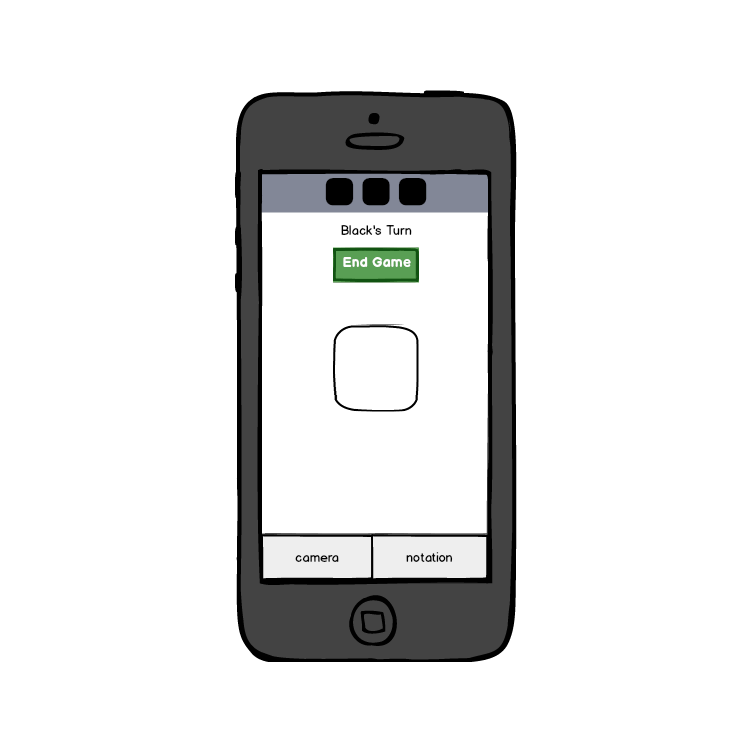

# Rooki Design

## Design Goals Iteration 1
- For Iteration 1 the design needs to prioritize basic functionality over tricks and extra features. The team will focus time into making sure the app is sleek and easy to use, but we are aware that we cannot dive too far into design until the application is fully functional. In future iterations we will clean up the design as new features are developed.

## User Research Iteration 1
- For Iteration 1 the team focused their attention on personal experience and gathered general research from chess players. 
- Since those that do not play chess are unlikely to use the app, all users from which we received feedback from were chess players themselves.
- Of players surveyed, ease of use and simplicity were the most cited desires from the app.

## Color palette Iteration 1
- We have chosen a simple color pallete consisting largely of blues and greys. 
-We started using a simple black and white theme white dark green accents, reminscent of our chess set and the green velvet underneath the pieces. We soon realized that our design looked like it was from an early 2000s webpage, and the design was ditched for something less offensive to the eyes.

## Web Application vs. iOS Application
- We aimed to create the common color palette so that we could standardize the general appears of the web page and the iOS application.
- It was not in our original design to even have a web page, but after realizing that connecting our React Native frontend to our Django backend would be more of an endeavor than we had anticipated we created a web application with Django.
- In future iterations, our design will not include a web application as we anticipate to connect our frontent and backend rather soon.

## Wireframe Iteration 1

